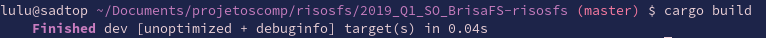
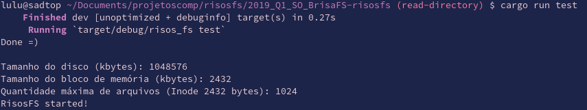
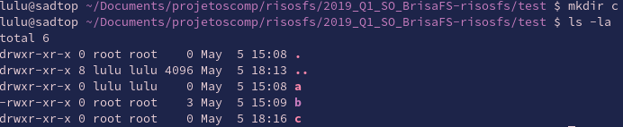

# RisosFS

Sistema de Arquivos desenvolvido em [Rust](https://www.rust-lang.org/) para a disciplina de Sistemas Operacionais da Universidade Federal do ABC, ministrada pelo professor [Emilio Francesquini](http://professor.ufabc.edu.br/~e.francesquini/) e [Fernando Teubl](http://professor.ufabc.edu.br/~fernando.teubl/) no 1º quadrimestre de 2019.

## Objetivo

Implementação de um sistema de arquivos que roda em cima de um disco "virtual" utilizando o FUSE, aplicando os conhecimentos adquiridos durante as aulas de Sistemas Operacionais e atendendo os [requisitos propostos](http://professor.ufabc.edu.br/~e.francesquini/2019.q1.so/projeto/index.html) pelo projeto.

## Instalação

Necessário instalar o [Rustup](https://www.rust-lang.org/learn/get-started), instalador e gerenciador de versão do Rust.

macOS ou Linux:
```
curl https://sh.rustup.rs -sSf | sh
```

## Compilação e Execução

Para compilar o programa, basta entrar no diretório raíz e executar o comando: `cargo build`.



Após compilado, para execução, basta utilizar o comando `cargo run <diretório>`, onde <diretório> é onde se deseja executar o FS.



Para utilizar o FS, abra outro terminal, entre na pasta onde o FS foi executado e utilize os comandos disponíveis.



## Comandos disponíveis

`ls`, `mkdir`, `chown`, `chgrp`, `rm [-rf]`

## Mais informações

Leia o [relatório](https://github.com/ufabc-bcc/2019_Q1_SO_BrisaFS-risosfs/blob/master/relatorio.md)